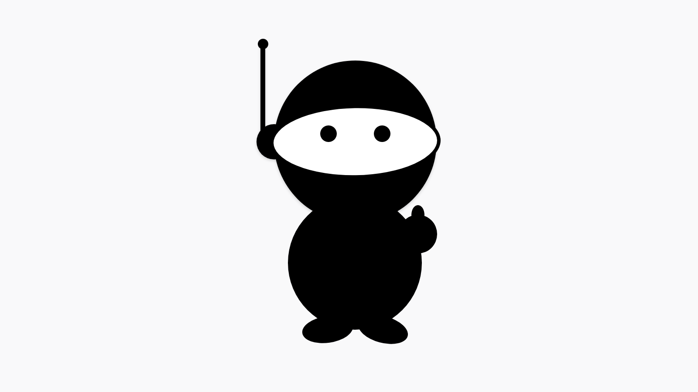
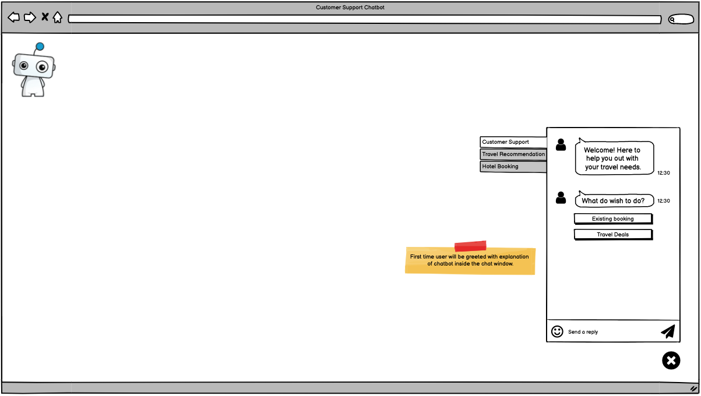
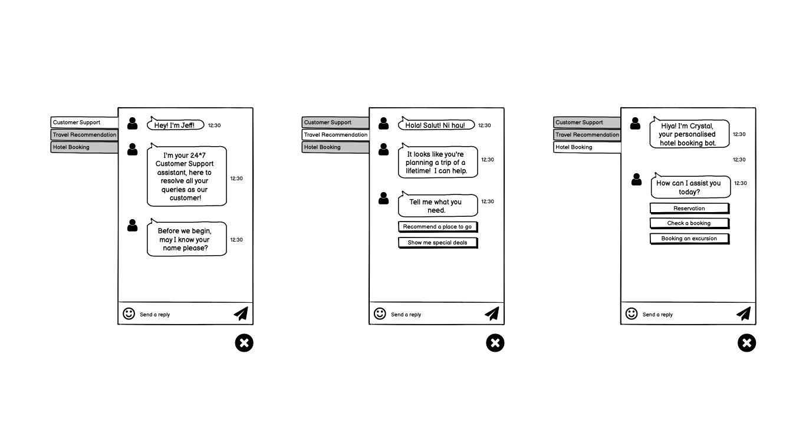

#### Use of AI in the Travel Industry

This emerging technology has been around in the travel space for a number of years now with many recognised brands, such as Qantas, SkyScanner, Expedia, having successfully deployed it across their operations.

#### My Role

For us Product Designers a large part of the job is to design products that are great for the end user but we also need to design for the business too.  In this project I assumed the role as, not only the Product Designer but kind of an acting Product Manager/Owner too.

**What were the problems or opportunities that the organisation were facing?**
Streamlining operations, improve booking experience for customers, dynamic content and increased customer service efficiency.

#### Solution
AI was to play a big part in helping us to alleviate our pain points. We knew we had to automate more and our goal of completing a digital transformation program to include chatbot implementation and dynamically driven content applications driven by AI was to be instrumental in doing so.  Just as SkyScanner had done before us we were looking at a chatbot solution to become our smart travel assistance. 

#### Why
As a publicly listed, Travel-Distribution Company providing a diverse range of travel wholesale products and services to markets globally, we could see that such a solution had the potential to help the organisation achieve it's strategic priorities.  In doing so it would improve customer engagement and the booking experience.  The benefits could help to build and maintain better relationships, increase efficiencies, reduce costs, engage customers and improve conversions.  It was a great idea to pitch to the stakeholders.

#### Core Ethical Considerations
If we were going to do this we wanted to do it properly and ethical concerns are big priority in software development especially when artificial intelligence is involved too.  We built a short list of considerations that we felt were important to us as a team and aligned with the organisation's objectives.  I won't talk about it in anygreat length so here's the dot points below:

* Transparency - there should be complete transparency to ensure people are fully aware of when they are being impacted by AI.
Human centred and wellbeing - I believe that AI systems should always respect human rights and diversity and any systems should be the benefit of individuals, society and the environment.
* Fairness - AI systems should be unbiased and not discriminate.
* Privacy and security - AI systems should respect people’s privacy and their data and should
practice a high level of security.
* Accountable - those involved at different stages of AI system development should be responsible and accountable for their choices and the outcomes.
* Contestability - in the event that an AI system has had a significant impact on someone, a group, society or the environment they should be permitted to freely challenge the use of the system.

#### Key Performance Indicators
We have chosen to measure the following key performance indicators as they align neatly with the organisation’s strategic priorities.

Activity volume | Evaluating the number of interactions from the time the user asks a simple question. 
Conversation length | Average length of interactions between chatbot and users.
Comprehension level | This would be continuously evolving. It is a measure of the chatbot’s comprehension and knowledge base.
Non-response rates | A measure of the number of times the chatbot fails to respond to a question. Can also be measured against comprehension level metric above.
Retention rate | This is the proportion of users who have consulted the chatbot on repeated occasions.
User engagement | measuring the number of messages exchanged.

#### Wireframing 
To support our proposal I began creating wireframes to begin illustrating the main conversation flows and to iron out any usability issues that might arise early on.  The wireframes are also great for getting stakeholders involved in the design process.

To prompt conversation from my working group I first created a wireframes for a desktop view, the conversation types that are currently required and a layout suitable for smaller devices.

We have identified three main conversation flows below that meet the requirements of the organisation.  Customer Support, Travel Recommendations and Hotel Bookings.  

These will also be available on mobile resolutions where the some of clutter will be removed for a cleaner interface.

#### Progress Report
The project is still ongoing although it was put on hold temporarily due to COVID.  We successfully pitched our solution and have a verbal approval to proceed.  I created a high level product road map and the next steps are to continue in the design phase and to build a prototype.  UX research will continue.  We have completed a deep dive analysis on products that exist on the market already to illiminate the need to reinvent the wheel   .